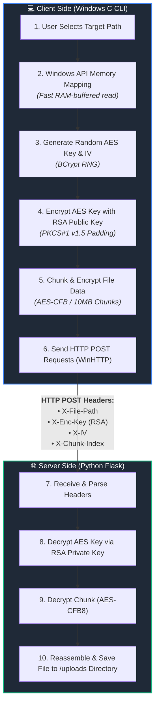

<div align="center">

# 🌉 IronBridge

```text
██╗██████╗  ██████╗ ███╗   ██╗██████╗ ██████╗ ██╗██████╗  ██████╗ ███████╗
██║██╔══██╗██╔═══██╗████╗  ██║██╔══██╗██╔══██╗██║██╔══██╗██╔════╝ ██╔════╝
██║██████╔╝██║   ██║██╔██╗ ██║██████╔╝██████╔╝██║██║  ██║██║  ███╗█████╗  
██║██╔══██╗██║   ██║██║╚██╗██║██╔══██╗██╔══██╗██║██║  ██║██║   ██║██╔══╝  
██║██║  ██║╚██████╔╝██║ ╚████║██████╔╝██║  ██║██║██████╔╝╚██████╔╝███████╗
╚═╝╚═╝  ╚═╝ ╚═════╝ ╚═╝  ╚═══╝╚═════╝ ╚═╝  ╚═╝╚═╝╚═════╝  ╚═════╝ ╚══════╝
```


### 🔒 Secure Emergency File Backup & Exfiltration Tool

*IronBridge is a high-performance Client-Server security solution designed to safely encrypt and exfiltrate critical files directly to a remote server using native Windows APIs, Memory Mapping, and Hybrid Cryptography.*

---

</div>

## ⚙️ How It Works (Execution Flow)



---

## ✨ Key Features

* **Hybrid Cryptography:** Combines fast symmetric encryption (AES-256 CFB) for file data with asymmetric encryption (RSA-2048) for secure key transfer.
* **Native Windows API:** Utilizes Windows `BCrypt` for cryptography and `WinHTTP` for network communication without external heavy C libraries.
* **Memory Mapping:** Uses `CreateFileMapping` and `MapViewOfFile` to map files directly into RAM for optimal reading performance.
* **Chunked Streaming:** Automatically splits large files into 10MB chunks to ensure stable HTTP transport.

---

## 🛠️ Build & Setup

### 1. Client (C / Windows)
Requires a C compiler on Windows with access to system libraries (`bcrypt.lib`, `winhttp.lib`).

**Using GCC (MinGW):**
```bash
cd Client
gcc src/main.c src/core.c src/ui.c -o IronBridge.exe -I include -lbcrypt -lwinhttp
```

**Using MSVC (cl.exe):**
```cmd
cd Client
cl.exe /I include src\*.c /link bcrypt.lib winhttp.lib /out:IronBridge.exe
```

### 2. Server (Python / Flask)
```bash
cd Server
python -m venv venv
venv\Scripts\activate
pip install -r requirements.txt
```

---

## ⚠️ Important Configurations

* **Server Endpoint:** The client connects to `127.0.0.1:5000` by default. Update the host IP in `Client/src/core.c` inside the `WinHttpConnect` function if running over a network.
* **RSA Keypair:** The RSA public key is hardcoded in `Client/src/core.c` (`rsa_pub_blob`), and its matching private key must be located at `Server/private_key.pem`.

---

## 🚀 Execution & Output

**Step 1: Start the Server**
```bash
cd Server
python app.py
```
*Output:* Server listens on `http://127.0.0.1:5000`.

**Step 2: Run the Client**
```cmd
cd Client
IronBridge.exe
```

**Sample Interactive Console Output:**
```text
========================================
      IRON BRIDGE - Security Tool       
========================================
[+] Enter path (directory/file) (1)
[+] Help (2)
[+] About (3)

Enter option(1/2/3) : 1
[+] Please enter the full path to the file/directory:
> C:\Users\DedSec\Documents\Important.docx

[*] Initializing memory mapping for file: 'C:\Users\DedSec\Documents\Important.docx'
[INFO] File Size: 154820 bytes
[+] File successfully loaded into RAM!
[+] AES Key successfully encrypted with RSA!
[*] Sending Important.docx in 1 chunks...
    -> Sending chunk 1/1 (154820 bytes)...
[+] Network handles closed safely.
```

**Server Console Output:**
```text
[*] Decrypted chunk 1/1 for 'Important.docx'
[+] File 'Important.docx' fully assembled and decrypted!
```
